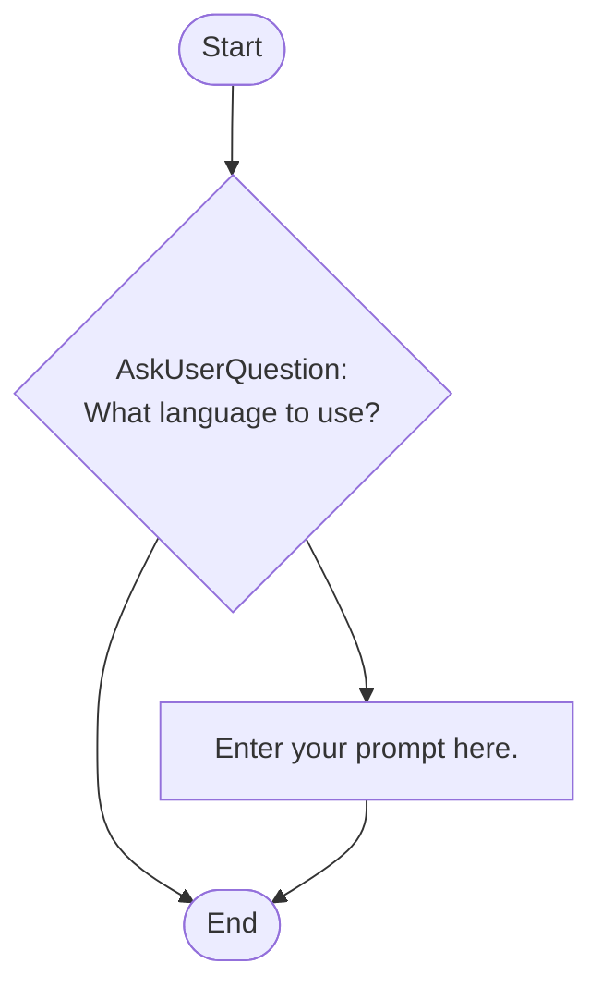

## Workflow Execution Guide

Follow the Mermaid flowchart above to execute the workflow. Each node type has specific execution methods as described below.

### Execution Methods by Node Type

- **Rectangle nodes (Sub-Agent: ...)**: Execute Sub-Agents
- **Diamond nodes (AskUserQuestion:...)**: Use the AskUserQuestion tool to prompt the user and branch based on their response
- **Diamond nodes (Branch/Switch:...)**: Automatically branch based on the results of previous processing (see details section)
- **Rectangle nodes (Prompt nodes)**: Execute the prompts described in the details section below

### Prompt Node Details

#### prompt_1772221261916(Enter your prompt here.)

```
Enter your prompt here.

You can use variables like {{variableName}}.
```

### AskUserQuestion Node Details

Ask the user and proceed based on their choice.

#### question_1772218260768(What language to use?)

**Selection mode:** Multi-select enabled (a list of selected options is passed to the next node)

**Options:**
- **Option 1**: New option
- **Option 2**: New option
