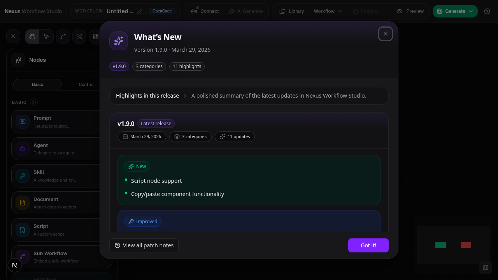
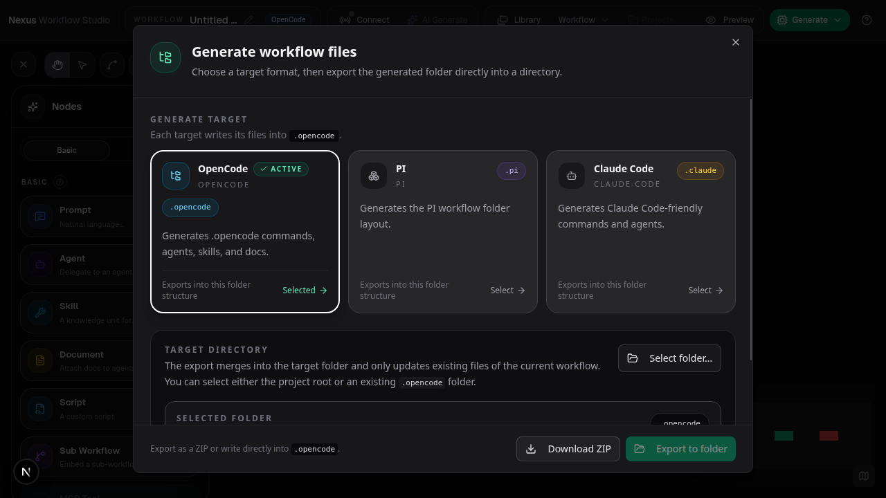

# Add Run Scripts to Workflow Export

**ADW ID:** 4bee7ec4
**Date:** 2026-04-01
**Plan:** docs/tasks/feature-add-export-run-scripts-4bee7ec4/plan-feature-add-export-run-scripts-4bee7ec4.md

## Overview

Every workflow export (ZIP download and directory export) now includes `run-<name>.sh` and `run-<name>.bat` scripts at the root level. These scripts allow users to run an exported workflow against their code repository without modifying the repo's existing `.claude/` or `.opencode/` configuration.

## Screenshots

## What Was Built

- **Run script generator module** — generates bash (`.sh`) and batch (`.bat`) run scripts per generation target
- **Workflow generator integration** — run scripts are automatically included in every workflow export
- **Directory export partitioning** — root-level files (run scripts) are written to the user-selected root, while target-dir files go into the target subdirectory

## Technical Implementation

### Files Modified

- `src/lib/run-script-generator.ts`: New module with `TARGET_CLI` config map, bash/batch template builders, and exported `generateRunScriptFiles()` function
- `src/lib/workflow-generator.ts`: Imports and calls `generateRunScriptFiles()`, spreads results into the generated files array
- `src/lib/generated-workflow-export.ts`: Added `partitionByRoot()` helper to separate root-level files from target-dir files; updated `exportGeneratedWorkflowToDirectory()` to write each set to the correct directory handle

### Key Changes

- `TARGET_CLI` maps each `GenerationTargetId` (`claude-code`, `opencode`, `pi`) to its CLI binary name and `--add-dir` flag
- Bash scripts capture `REPO_DIR` (user's CWD) and `SCRIPT_DIR` (export location), then `cd` to the script dir and `exec` the CLI with `--add-dir` pointing back to the repo
- Batch scripts follow the same pattern using `%CD%` and `%~dp0`
- `partitionByRoot()` splits generated files by checking if their path starts with the target's `rootDir/` prefix
- ZIP export requires no changes — jszip handles root-level paths correctly

## How to Use

1. Open a workflow in NexusWorkflowStudio
2. Open the Generate/Export dialog (`Ctrl+Alt+G`)
3. Select a generation target (Claude Code, OpenCode, or PI)
4. Download as ZIP or export to a directory
5. Extract/copy the export into your code repository
6. Run the workflow from your repo root:
   - **Linux/macOS**: `bash run-<workflow-name>.sh [args...]`
   - **Windows**: `run-<workflow-name>.bat [args...]`

The script automatically resolves paths so the CLI tool reads config from the export directory while operating on your repository.

## Configuration

No additional configuration is required. The run scripts are generated automatically for all three supported targets:

| Target | CLI Binary | Flag |
|--------|-----------|------|
| Claude Code | `claude` | `--add-dir` |
| OpenCode | `opencode` | `--add-dir` |
| PI | `pi` | `--add-dir` |

## Testing

1. Export a workflow as ZIP for each target
2. Verify `run-<name>.sh` and `run-<name>.bat` exist at the ZIP root (alongside `.claude/` or equivalent)
3. Verify bash script contains correct shebang, `REPO_DIR`/`SCRIPT_DIR` resolution, and `exec <bin> --add-dir` invocation
4. Verify batch script contains `@echo off`, environment variable setup, and correct CLI invocation
5. Run `npm run build`, `npm run typecheck`, and `npm run lint` — all should pass with zero errors

## Notes

- Run scripts are only generated for top-level workflows, not for sub-workflow recursive generation
- The `--add-dir` flag for `opencode` and `pi` CLIs should be verified against their actual documentation
- If a user selects the `.claude/` folder itself as the export root, run scripts will land inside it — this is an accepted edge case
