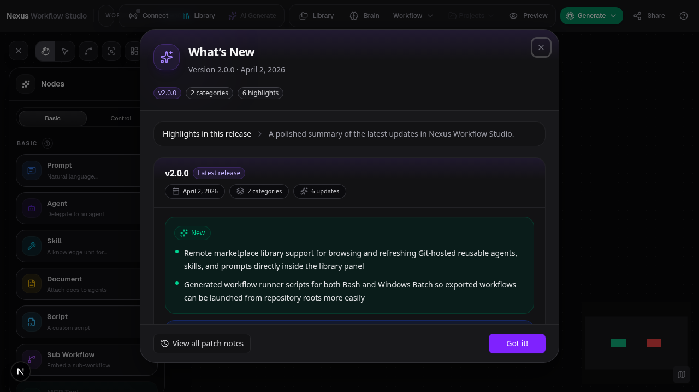
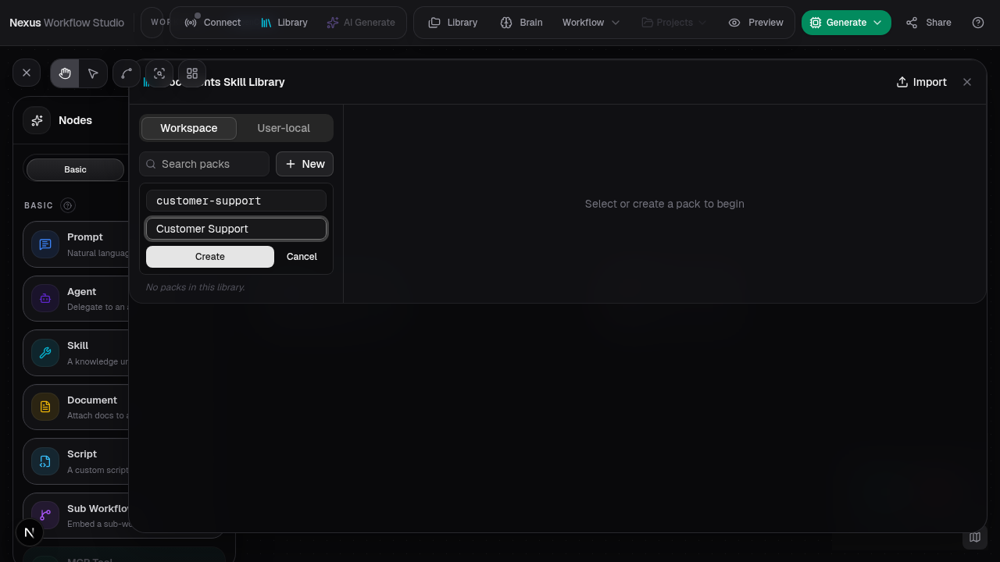
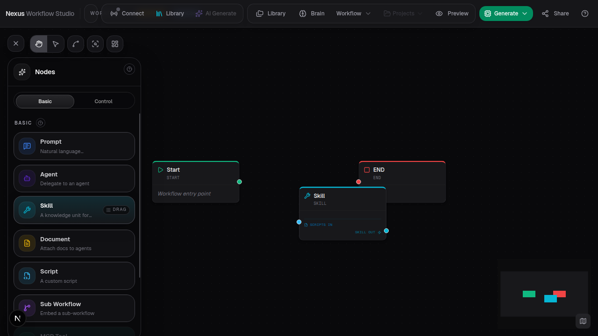
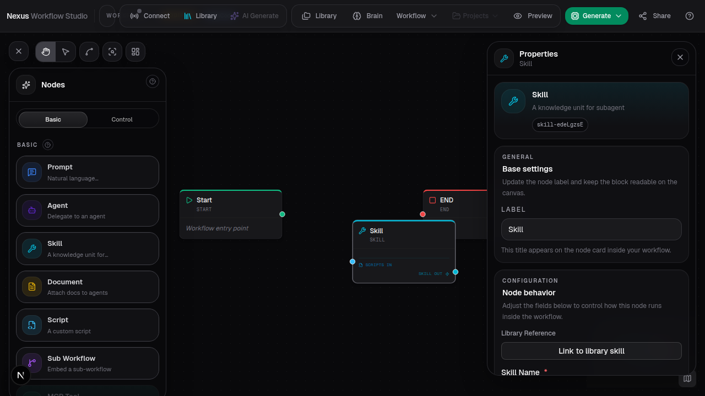
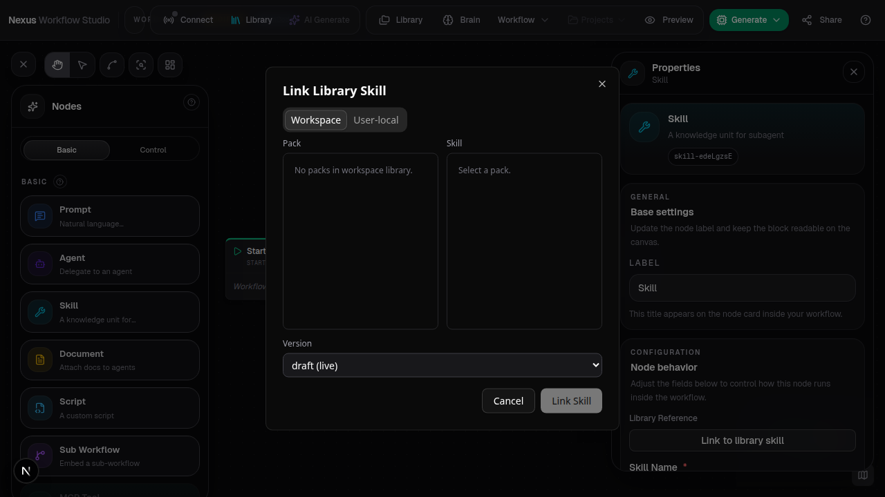

# Documents Skill Library

**ADW ID:** 60d267bf
**Date:** 2026-04-25
**Plan:** docs/tasks/feature-documents-skill-library-60d267bf/plan-feature-documents-skill-library-60d267bf.md

## Overview

Adds a versioned, sharable home for Markdown skills with workspace and user-local
scopes, branchable packs, real-time collaborative editing, publish flows, and a
self-contained `.nexus` archive export. Workflow Skill nodes can now reference a
library skill by `scope + packId + packVersion + skillId`, and exported workflows
bundle every reachable pack so they resolve offline.

## Screenshots

## What Was Built

- Filesystem-backed library metadata store with RustFS-shaped object keys
  (`src/lib/library-store/`)
- API surface under `src/app/api/library/**` covering session, packs, documents,
  versions, skills, fork, merge-base, conflict resolve, publish, resolve, import,
  and export
- Three-way Markdown merge with conflict records and an inline resolver dialog
- Pack/skill/document validation (entrypoint, frontmatter, duplicate ids,
  broken references, manifest mismatches, deleted-but-referenced docs)
- Documents panel UI: scope tabs, pack browser, four-column pack detail with
  file tree, Markdown editor, preview, skill detail/validation, and publish/branch
  panels
- Per-document Y.js collab binding reusing the Hocuspocus server (room name
  `lib:{workspaceId}:{scope}:{packId}:{docId}`)
- Skill node `libraryRef` data field plus a `SkillPickerDialog` for linking a
  workflow Skill node to a library skill at a specific version (or `draft`)
- Skill generator routes content through the resolved library bundle when a ref
  is set, falling back to inline behavior otherwise
- `.nexus` archive export with `manifest.json`, `workflow.json`, snapshotted pack
  contents, `runtime/resolver-metadata.json`, and `hashes.json`
- Import for Nexus-native archives and best-effort Agent Skills folders/zips
- Test coverage for storage, merge, validation, export, import, resolver, and
  the library Zustand store

## Technical Implementation

### Files Modified

- `src/types/workflow.ts`: extends node-data union for the new `libraryRef`
- `src/nodes/skill/types.ts`: adds `SkillLibraryRef` interface to `SkillNodeData`
- `src/nodes/skill/constants.ts`: defaults `libraryRef: null`; Zod schema entry
- `src/nodes/skill/generator.ts`: accepts a resolved `SkillBundle` and emits
  pack-derived `SKILL.md` content when a library ref is set
- `src/nodes/skill/fields.tsx`, `src/nodes/skill/node.tsx`: render library
  reference badge + "Link to library skill" entry point
- `src/components/workflow/properties/skill-picker-dialog.tsx`: new dialog for
  picking scope/pack/skill/version
- `src/components/workflow/generated-export-dialog.tsx`: adds the `.nexus`
  archive option to the export flow
- `src/components/workflow/header/session-actions.tsx`,
  `src/components/workflow/workflow-editor.tsx`: surfaces the Documents panel
  toggle in the header
- `src/lib/collaboration/collab-doc.ts`: small adjustment compatible with the
  new per-document collab binding
- `.env.example`, `.gitignore`, `docker-compose.yml`, `next.config.ts`,
  `scripts/start.sh`, `README.md`: env, ignore, deploy, and docs wiring for
  `NEXUS_LIBRARY_DATA_DIR`

### New Files (selected)

- `src/lib/library-store/store.ts`: `LibraryStore` class — packs, skills,
  documents, versions, branches, merges, publish, resolve. Singleton via
  `getLibraryStore()` mirroring `BrainStore`
- `src/lib/library-store/object-store.ts`: `ObjectStorage` interface +
  filesystem driver with immutable version keys
- `src/lib/library-store/merge.ts`: line-based diff3 with structured conflicts
- `src/lib/library-store/manifest.ts`, `validation.ts`: normalized manifest +
  full validation rule set
- `src/lib/library-store/resolver.ts`: live and artifact-mode skill resolution
- `src/lib/library-store/export.ts`, `import.ts`: `.nexus` archive build /
  read with hash verification
- `src/lib/library-store/schemas.ts`: Zod-v4 schemas for manifest, frontmatter,
  and every API payload
- `src/lib/library-client.ts`: typed fetch wrapper using the Brain token
- `src/lib/collaboration/lib-doc-collab.ts`: per-document Y.Text room opener
- `src/store/library-docs/`: Zustand slice for packs/skills/documents and
  pending merges
- `src/types/library.ts`: shared types (`LibraryScope`, `PackRef`, `SkillRef`,
  `SkillBundle`, `MergeState`, `ValidationWarning`)
- `src/components/workflow/documents-panel/`: panel, pack-browser, pack-detail,
  file-tree, doc-editor, markdown-preview, skill-detail-panel, publish-panel,
  branch-status-panel, conflict-resolve-dialog, import-dialog, controller hook
- `src/app/api/library/**/route.ts`: 18 routes covering session, packs, fork,
  merge-base, documents, versions, skills, merges, resolve, import, export

### Key Changes

- Library metadata persists in a single `manifest.json` plus per-version files
  under `NEXUS_LIBRARY_DATA_DIR` (default `./.nexus-library`); the layout matches
  S3/RustFS keys so a future driver swap is single-file
- Document version writes use optimistic concurrency on `previousVersionId`;
  stale heads are rejected with `StaleVersionError`
- Publishing a pack snapshots every current document head into
  `pack_version_documents` and writes a normalized manifest at
  `packs/{packId}/versions/{versionId}/manifest.json`; published versions are
  immutable
- Skill node generation calls `resolveLive()` (or reads from the artifact at
  export time) and feeds a `SkillBundle` into `generator.getSkillFile()`. With
  no `libraryRef`, the inline path is preserved for back-compat
- Forking a workspace pack creates a user-local copy with `base_version_id` set
  per document; "Merge latest base" runs three-way merge, producing clean
  versions or `document_merges` + `document_conflicts` for conflicting edits
- The `.nexus` export traverses every Skill node's `libraryRef`, gathers the
  pack manifest + closure of referenced docs/rules/assets, and writes
  SHA-256 hashes for every file alongside resolver metadata so an importer can
  resolve skills without the live store

## How to Use

1. Open the editor and click **Library** in the header toolbar to open the
   Documents Skill Library panel.
2. In the **Workspace** tab, click **+ New** and create a pack (e.g.
   `customer-support`).
3. Inside the pack, create a skill — this generates a `SKILL.md` entrypoint.
   Edit the Markdown in the doc editor; saves create new immutable versions.
4. Add supporting documents under appropriate roles (references, docs, rules,
   templates, examples, assets).
5. Click **Publish pack version**, enter a semver string, and confirm — the
   panel will block publish if validation warnings exist.
6. To consume a skill in a workflow: drop a **Skill** node, open its properties,
   click **Link to library skill**, choose scope → pack → skill → version, and
   confirm. The node displays a pack badge and the generator pulls content from
   the pack on export.
7. To share a workflow self-contained: open **Generate / Export** → choose
   **Nexus archive** → download. Re-importing the `.nexus` file reproduces the
   linked packs and skills byte-for-byte.
8. To branch: open a workspace pack, click **Fork to user-local**. Edit your
   fork independently; when the workspace base advances, click **Merge latest
   base** in the branch status panel to pull updates (conflicts open the
   resolver dialog).

## Configuration

- `NEXUS_LIBRARY_DATA_DIR` — directory for the library manifest and version
  objects (default `./.nexus-library`)
- `NEXUS_BRAIN_TOKEN_SECRET` — reused for library session HMAC tokens so the
  library shares the Brain workspace identity
- `.nexus-library/` is gitignored
- `docker-compose.yml` mounts a `.nexus-library` volume mirroring the Brain dir

## Testing

- `bun run test:lib` — covers `library-store`, `library-merge`,
  `library-validation`, `library-export`, `library-import`, `library-resolver`
- `bun run test:store` — covers the `library-docs` Zustand slice
- `bun run test:nodes` — Skill node generator (with and without `libraryRef`)
- `bun run typecheck` and `bun run lint` for type/lint regressions
- `bun run build` for export/route/wiring regressions
- Manual smoke (also captured in
  `e2e-feature-documents-skill-library-60d267bf.md`): create a pack, add a
  skill, save, publish `1.0.0`, fork to user-local, edit and republish base
  as `1.1.0`, merge into the fork, link the skill in a workflow Skill node,
  export `.nexus`, re-import, confirm the skill resolves with the same content

## Notes

- The codebase has no relational database; the same semantic schema is held in
  a JSON manifest plus per-record files. Swapping in Postgres/SpacetimeDB later
  is a storage-driver change.
- `.nexus` is provisional — exposed via a single helper for easy renaming.
- Scripts inside packs are stored as documents only; nothing in this feature
  executes user-supplied content.
- Existing Brain documents stay under `/api/brain`; the library is a parallel
  system. A `brain-migration.ts` helper exists for a one-click "import Brain
  docs into user library" flow.
- Workflows that pre-date this feature continue to work — Skill nodes default
  `libraryRef: null` and use the existing inline content path.
