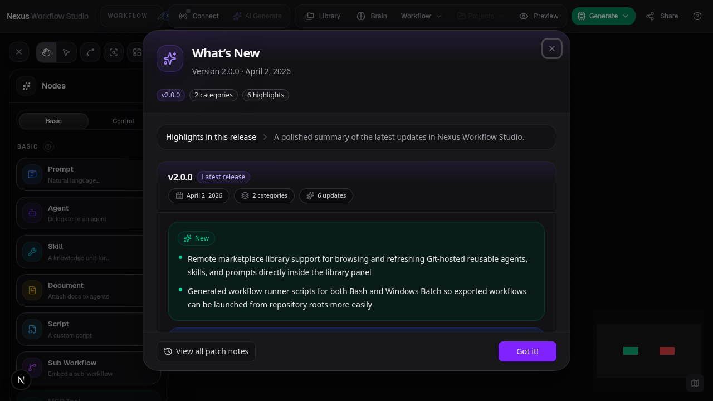
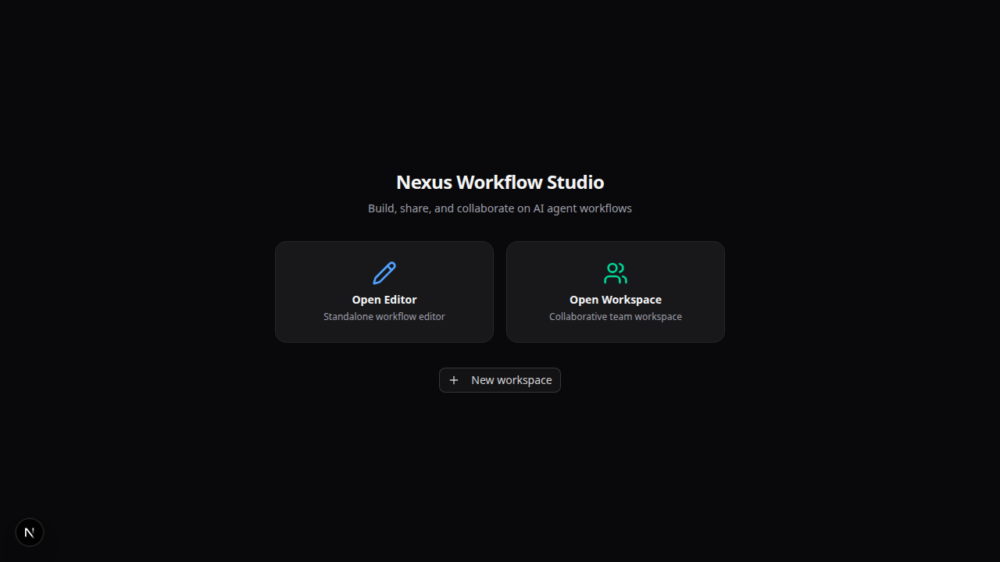

# SpacetimeDB Backend Sync

**ADW ID:** 9b6b801c
**Date:** 2026-04-11
**Plan:** docs/tasks/feature-spacetimedb-backend-sync-feature/plan-feature-spacetimedb-backend-sync-feature.md

## Overview

Adds SpacetimeDB as an optional persistence and real-time synchronization backend for workspace mode. When `NEXT_PUBLIC_SPACETIME_URI` is configured, workspace CRUD, workflow saves, Brain document operations, and multi-user presence all flow through SpacetimeDB instead of the filesystem REST API + Hocuspocus. Standalone editor/localStorage mode is completely unaffected.

The implementation targets the SpacetimeDB 2.1 TypeScript module and generated client binding APIs. The module source is `spacetime/nexus/src/index.ts`, and generated browser bindings are committed under `src/lib/spacetime/module_bindings/` so the main app can build without running the SpacetimeDB CLI.

## Screenshots






## What Was Built

- SpacetimeDB 2.1 TypeScript module with full table schema and reducers (`spacetime/nexus/src/index.ts`)
- Generated SpacetimeDB 2.1 TypeScript client bindings (`src/lib/spacetime/module_bindings/`)
- Client-side connection manager with generated `DbConnection` API usage, identity persistence, and reconnection (`src/lib/spacetime/client.ts`)
- Workspace sync bridge with loop-prevention pattern (`src/lib/spacetime/workspace-sync.ts`)
- Brain document sync bridge (`src/lib/spacetime/brain-sync.ts`)
- Presence/awareness layer via SpacetimeDB rows (`src/lib/spacetime/presence.ts`)
- SpacetimeDB type definitions and conversion utilities (`src/lib/spacetime/types.ts`)
- Configuration helpers (`src/lib/spacetime/config.ts`)
- Docker Compose service for SpacetimeDB server
- Data migration script (`scripts/migrate-to-spacetime.ts`)
- Binding generation script (`scripts/generate-spacetime-bindings.sh`)
- REST API route deprecation markers
- Unit tests for config and type conversions

## Technical Implementation

### Files Modified

- `src/components/workflow/workflow-editor.tsx`: Conditionally starts SpacetimeDB sync (workspace + brain + presence) instead of Y.js/Hocuspocus when `isSpacetimeConfigured()` returns true; skips REST-based autosave in SpacetimeDB mode; routes selection awareness through SpacetimeDB presence
- `src/store/collaboration/collab-store.ts`: Added SpacetimeDB connection state tracking alongside Hocuspocus state
- `src/lib/brain/client.ts`: Added SpacetimeDB-aware brain operations
- `docker-compose.yml`: Added `nexus-spacetimedb` service using `clockworklabs/spacetime:latest` image on port 30201
- `Dockerfile`: Added SpacetimeDB CLI installation for operational binding-generation support in the runtime image
- `.env.example`: Added `NEXT_PUBLIC_SPACETIME_URI`, `NEXT_PUBLIC_SPACETIME_DB_NAME`, `SPACETIME_MODULE_PATH`
- `package.json`: Added `@clockworklabs/spacetimedb-sdk` dependency
- `eslint.config.mjs`: Added ESLint ignore entries for SpacetimeDB module files and generated client bindings
- `tsconfig.json`: Updated for SpacetimeDB module compilation
- `CLAUDE.md`: Updated architecture notes documenting SpacetimeDB persistence layer
- REST API routes (`src/app/api/workspaces/`, `src/app/api/brain/`): Marked as deprecated shims

### New Files

- `spacetime/nexus/src/index.ts` (578 lines): Full SpacetimeDB 2.1 TypeScript module — 13 table definitions (workspace, workflow, nodes, edges, UI state, brain docs/versions/feedback, presence, change events, invites, members), reducers for CRUD/import operations, and `apply_workflow_ops` batch reducer
- `spacetime/nexus/package.json` + `package-lock.json`: Module-local SpacetimeDB 2.1 package metadata
- `spacetime/nexus/spacetimedb.toml` + `tsconfig.json`: Module configuration
- `src/lib/spacetime/client.ts` (246 lines): Singleton `SpacetimeClient` with WebSocket connection, identity token persistence in localStorage, exponential backoff reconnection, state change event emitters
- `src/lib/spacetime/workspace-sync.ts` (436 lines): Bidirectional sync bridge using `_isApplyingRemote` mutex pattern (mirrored from `collab-doc.ts`), batched node/edge changes, transient React Flow property cleaning
- `src/lib/spacetime/brain-sync.ts` (219 lines): Brain document sync — subscribes to brain_doc/version/feedback rows, replaces REST-based brain API calls with reducer calls
- `src/lib/spacetime/presence.ts` (220 lines): Selection awareness via ephemeral presence rows, 500ms throttled updates, server-side disconnect cleanup
- `src/lib/spacetime/types.ts` (241 lines): TypeScript interfaces for all SpacetimeDB row shapes, reducer payloads, operation types for `apply_workflow_ops`, conversion utilities between SpacetimeDB and Zustand types
- `src/lib/spacetime/config.ts` (33 lines): Configuration helpers — `getSpacetimeUri()`, `getSpacetimeDbName()`, `isSpacetimeConfigured()`
- `scripts/migrate-to-spacetime.ts` (348 lines): Idempotent migration script reads existing filesystem data and calls SpacetimeDB import reducers
- `scripts/generate-spacetime-bindings.sh`: Binding generation for dev/CI
- `src/lib/__tests__/spacetime-config.test.ts` + `spacetime-types.test.ts`: Unit tests

### Key Changes

- **Conditional sync path**: The workflow editor detects SpacetimeDB configuration at mount time and starts either SpacetimeDB sync or the legacy Y.js/Hocuspocus path — never both
- **Loop prevention**: The `_isApplyingRemote` flag pattern from `collab-doc.ts` is faithfully replicated in both `workspace-sync.ts` and `brain-sync.ts` to prevent feedback loops between SpacetimeDB subscriptions and Zustand store updates
- **Batched operations**: Node/edge mutations are collected during drag operations and flushed via `apply_workflow_ops` on drag-stop or a 200ms throttle interval
- **Membership checks**: Reducers validate workspace membership before workspace, workflow, Brain, and presence mutations
- **Change events**: Reducers write `workflow_change_event` rows for the recent-changes feed, replacing filesystem-based snapshot diffs

## How to Use

1. **Start SpacetimeDB** via Docker Compose:
   ```bash
   docker compose up nexus-spacetimedb -d
   ```

2. **Configure environment** by setting these variables (in `.env.local` or environment):
   ```
   NEXT_PUBLIC_SPACETIME_URI=ws://localhost:30201
   NEXT_PUBLIC_SPACETIME_DB_NAME=nexus
   ```

3. **Publish the SpacetimeDB module** (first time or after schema changes):
   ```bash
   spacetime publish -p spacetime/nexus nexus
   ./scripts/generate-spacetime-bindings.sh
   ```

4. **Start the app** normally:
   ```bash
   bun run dev
   ```

5. **Open Workspace mode** — the app automatically uses SpacetimeDB for persistence and sync when the env vars are set

6. **Migrate existing data** (optional, for existing filesystem-based workspaces):
   ```bash
   bun run scripts/migrate-to-spacetime.ts
   ```

## Configuration

| Variable | Description | Default |
|---|---|---|
| `NEXT_PUBLIC_SPACETIME_URI` | WebSocket URI for SpacetimeDB | Not set (disables SpacetimeDB) |
| `NEXT_PUBLIC_SPACETIME_DB_NAME` | Database/module name | `nexus` |
| `SPACETIME_MODULE_PATH` | Path to SpacetimeDB module source | `spacetime/nexus` |
| `SPACETIME_PORT` | Host port for Docker (docker-compose only) | `30201` |

When `NEXT_PUBLIC_SPACETIME_URI` is **not set**, the app falls back to the existing filesystem REST API + Hocuspocus persistence layer. Standalone editor mode (no workspace) always uses localStorage regardless of configuration.

## Testing

- **Unit tests**: `bun run test -- src/lib/__tests__/spacetime-config.test.ts src/lib/__tests__/spacetime-types.test.ts`
- **Type checking**: `bun run typecheck`
- **Manual E2E**: See `docs/tasks/feature-spacetimedb-backend-sync-feature/e2e-feature-spacetimedb-backend-sync-feature.md` for the full end-to-end test specification covering multi-tab sync, invite links, reconnection, and standalone mode verification

## Notes

- Hocuspocus/Y.js is retained for standalone `?room=` collaboration mode — only workspace mode switches to SpacetimeDB
- REST API routes under `src/app/api/workspaces/` and `src/app/api/brain/` are marked as deprecated shims and will be removed once all clients use SpacetimeDB directly
- Node data is stored as JSON strings in SpacetimeDB columns to minimize migration risk and avoid encoding the full discriminated union as strict SpacetimeDB types
- OpenCode local server calls, marketplace Git operations, generated ZIP exports, and browser-only preferences remain outside SpacetimeDB
- The `src/lib/spacetime/module_bindings/` directory contains generated SpacetimeDB 2.1 TypeScript client bindings. Do not hand-edit these files; run `scripts/generate-spacetime-bindings.sh` after module schema changes and commit the regenerated output.
